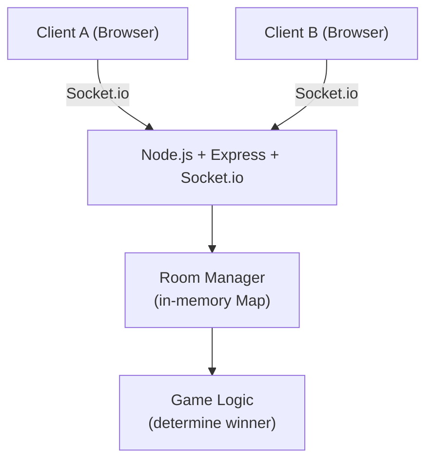
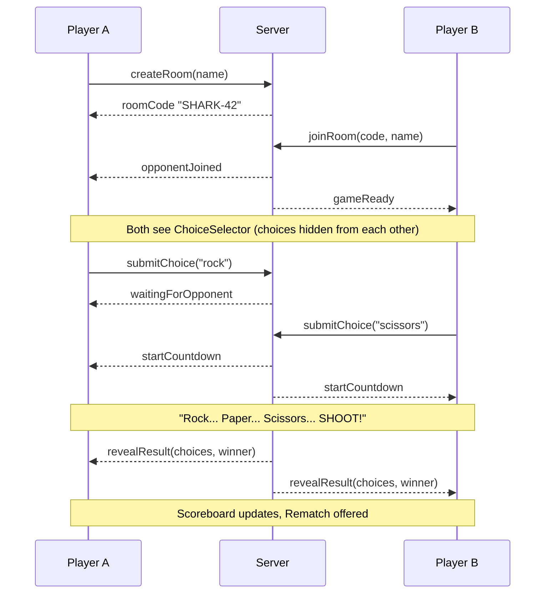

# Multiplayer Rock Paper Scissors — Build Plan

## Architecture



## Project Structure

```
rockpaperscissors/
├── client/                   # React + Vite (TypeScript)
│   └── src/
│       ├── components/
│       │   ├── NameEntry.tsx         # Player name input screen
│       │   ├── RoomScreen.tsx        # Create/join room with code
│       │   ├── WaitingRoom.tsx       # Waiting for opponent
│       │   ├── ChoiceSelector.tsx    # Hidden R/P/S buttons
│       │   ├── Countdown.tsx         # "Rock... Paper... Scissors... SHOOT!"
│       │   ├── RevealScreen.tsx      # ASCII art reveal + result
│       │   └── Scoreboard.tsx        # Win/loss/tie counters
│       ├── socket.ts                 # Socket.io client singleton
│       └── types.ts                  # Shared game types (mirrored)
├── server/
│   ├── index.ts                      # Express + Socket.io setup
│   ├── roomManager.ts                # Room creation, joining, state
│   └── gameLogic.ts                  # Winner determination
└── shared/
    └── types.ts                      # Choice, GameState, RoomState types
```

## Tech Stack

| Layer | Technology |
|---|---|
| Frontend | React + Vite + TypeScript |
| Styling | TailwindCSS |
| Animation | CSS transitions (text-based countdown) |
| Real-time | Socket.io v4 |
| Backend | Node.js + Express + TypeScript |
| State | In-memory Map (no DB needed for MVP) |
| Hosting | Railway or Render (WebSocket support) |

## Game Flow



## Text-Based ASCII Graphics

Choices displayed as large ASCII art on reveal:

```
    ROCK          PAPER         SCISSORS
    _____         _____           __
---'   __\       |     |         |  |-----.
      (    )     |     |         |  |      \
      (    )     |     |         |  |-------|
      (    )     |_____|         |__|
---.__(___)
```

Countdown uses large spaced text rendered character-by-character with a timed delay between "Rock...", "Paper...", "Scissors...", "SHOOT!".

## Socket.io Events

| Event (Client → Server) | Payload |
|---|---|
| `create_room` | `{ playerName }` |
| `join_room` | `{ roomCode, playerName }` |
| `submit_choice` | `{ choice: "rock" \| "paper" \| "scissors" }` |
| `request_rematch` | `{}` |

| Event (Server → Client) | Payload |
|---|---|
| `room_created` | `{ roomCode }` |
| `opponent_joined` | `{ opponentName }` |
| `waiting_for_opponent` | `{}` |
| `start_countdown` | `{}` |
| `reveal_result` | `{ yourChoice, opponentChoice, winner }` |
| `opponent_disconnected` | `{}` |
| `rematch_ready` | `{}` |

## Build Order

1. **Project scaffold** — Vite client + Node server + shared types, Socket.io connected
2. **Room management** — `create_room` / `join_room` with 6-character alphanumeric codes
3. **Name entry + room screens** — NameEntry → RoomScreen flow
4. **Choice submission** — Hidden buttons, server stores both choices
5. **Countdown + reveal** — Timed text animation, ASCII art reveal
6. **Winner logic + scoreboard** — Determine winner, update session counts
7. **Rematch + disconnect handling** — Rematch flow, graceful disconnect messages
8. **Polish** — Mobile layout, copy-to-clipboard room code button
