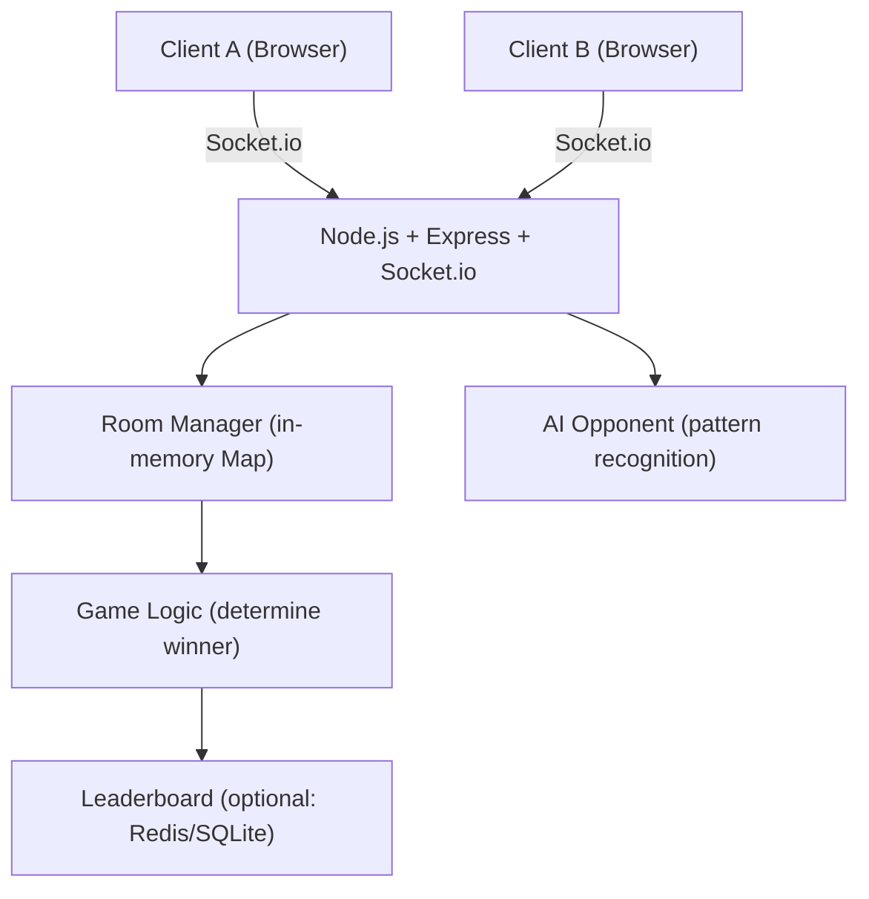
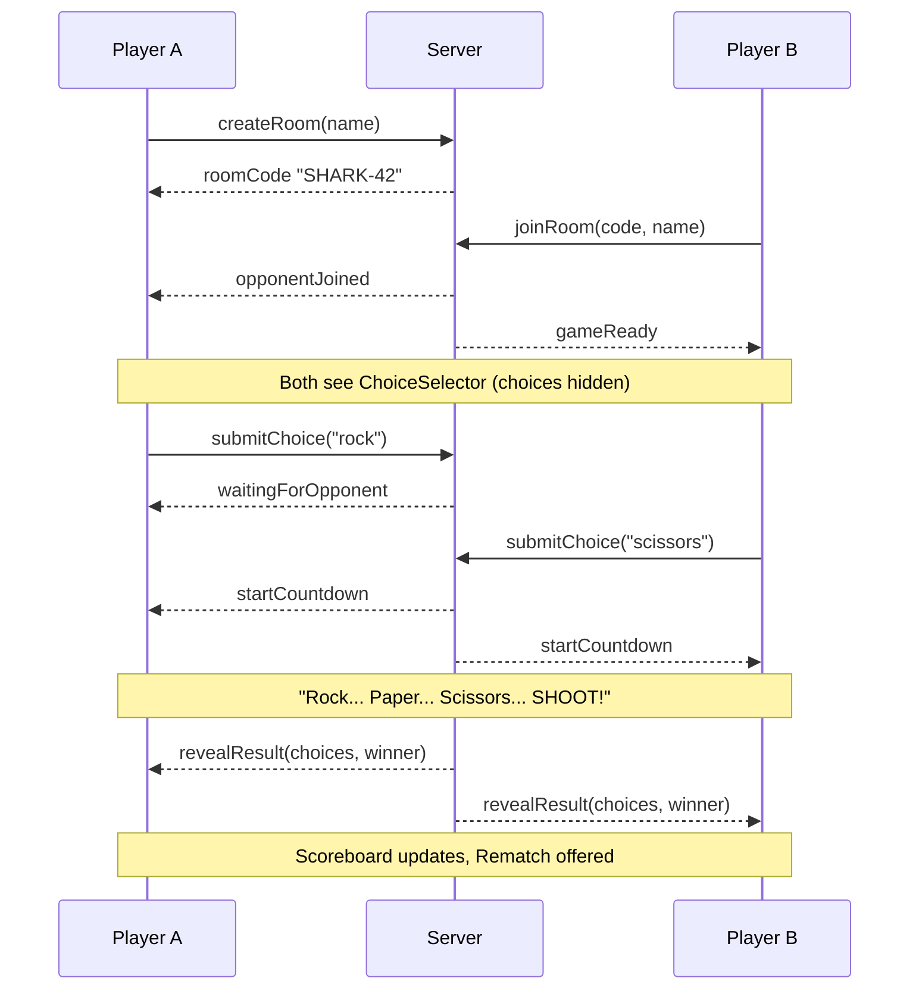

# Multiplayer Rock Paper Scissors — Improved Build Plan

## Team Roles

| Member | Role | Focus Area |
|--------|------|------------|
| **You (Lead)** | Full-Stack Architect | Scaffold, server core, Socket.io events, game logic, deployment |
| **Member 2** | Frontend Dev | All React UI screens, countdown animation, ASCII reveal, styling |
| **Member 3** | Backend + Stretch | Rematch/disconnect, AI opponent, leaderboard, tournament mode |

---

## Architecture



## Project Structure

```
rockpaperscissors/
├── client/                          # React + Vite (TypeScript)
│   └── src/
│       ├── components/
│       │   ├── NameEntry.tsx        # Player name input screen
│       │   ├── RoomScreen.tsx       # Create/join room with code
│       │   ├── WaitingRoom.tsx      # Waiting for opponent
│       │   ├── ChoiceSelector.tsx   # Hidden R/P/S buttons
│       │   ├── Countdown.tsx        # "Rock... Paper... Scissors... SHOOT!"
│       │   ├── RevealScreen.tsx     # ASCII art reveal + result
│       │   └── Scoreboard.tsx       # Win/loss/tie counters
│       ├── socket.ts                # Socket.io client singleton
│       └── types.ts                 # Shared game types (mirrored)
├── server/
│   ├── index.ts                     # Express + Socket.io setup
│   ├── roomManager.ts               # Room creation, joining, state
│   ├── gameLogic.ts                 # Winner determination
│   ├── aiOpponent.ts                # AI pattern recognition (stretch)
│   └── leaderboard.ts               # Persistent stats (stretch)
├── shared/
│   └── types.ts                     # Choice, GameState, RoomState types
├── CLAUDE.md                        # AI coding context (always keep updated)
└── .cursor/rules/                   # Cursor AI rules
    ├── core.mdc
    ├── frontend.mdc
    └── backend.mdc
```

## Tech Stack

| Layer | Technology |
|-------|------------|
| Frontend | React + Vite + TypeScript |
| Styling | TailwindCSS |
| Animation | CSS transitions (text-based countdown) |
| Real-time | Socket.io v4 |
| Backend | Node.js + Express + TypeScript |
| State | In-memory Map (no DB needed for MVP) |
| Leaderboard (stretch) | SQLite via better-sqlite3 |
| Hosting | Railway or Render (WebSocket support) |

---

## Game Flow



## Text-Based ASCII Graphics

Choices displayed as large ASCII art on reveal:

```
    ROCK          PAPER         SCISSORS
    _____         ___________       O O
---'   __\       |           |     \   /
      (    )     |  PAPER    |      \ /
      (    )     |___________|       X
      (    )                        / \
---.__(___)
```

Countdown uses large spaced text rendered character-by-character with a timed delay between "Rock...", "Paper...", "Scissors...", "SHOOT!".

## Socket.io Events

| Event (Client → Server) | Payload |
|--------------------------|---------|
| `create_room` | `{ playerName }` |
| `join_room` | `{ roomCode, playerName }` |
| `submit_choice` | `{ choice: "rock" \| "paper" \| "scissors" }` |
| `request_rematch` | `{}` |
| `play_vs_ai` | `{ playerName, difficulty }` (stretch) |

| Event (Server → Client) | Payload |
|--------------------------|---------|
| `room_created` | `{ roomCode }` |
| `opponent_joined` | `{ opponentName }` |
| `waiting_for_opponent` | `{}` |
| `start_countdown` | `{}` |
| `reveal_result` | `{ yourChoice, opponentChoice, winner }` |
| `opponent_disconnected` | `{}` |
| `rematch_ready` | `{}` |
| `leaderboard_update` | `{ topPlayers }` (stretch) |

---

## Task Assignments

### YOU (Lead) — Full-Stack Architect

> You own the foundation that everyone else builds on. Do these first so teammates can unblock.

#### Phase 1 — Scaffold (do this FIRST, ~20 min)
- [ ] `scaffold` — Init Vite React client + Node.js server + shared types
  - `npm create vite@latest client -- --template react-ts`
  - `cd server && npm init -y && npm i express socket.io tsx typescript`
  - Wire Socket.io client ↔ server with a test `ping/pong` event
  - Commit immediately so teammates can pull and start

#### Phase 2 — Server Core (~30 min)
- [ ] `room-management` — Implement `roomManager.ts`
  - 6-character alphanumeric room codes
  - `create_room` / `join_room` socket handlers
  - Room state: `{ players: [Player], choices: Map, scores: Map }`
- [ ] `game-logic` — Implement `gameLogic.ts`
  - `determineWinner(a: Choice, b: Choice): 'player1' | 'player2' | 'tie'`
  - Emit `start_countdown` when both choices received
  - Emit `reveal_result` after countdown

#### Phase 3 — Integration & Deployment (~20 min)
- [ ] `deployment` — Deploy to Railway/Render
  - Set `PORT` env var, configure WebSocket support
  - Share live URL with team for testing

---

### MEMBER 2 — Frontend Dev

> Pull the scaffold once Lead commits it. You own everything the player sees.

#### Phase 1 — Core Screens (~40 min)
- [ ] `name-room-screens` — `NameEntry.tsx` + `RoomScreen.tsx`
  - Name input → create room (shows code) or join room (enter code)
  - Copy-to-clipboard button on room code
- [ ] `waiting-room` — `WaitingRoom.tsx`
  - Spinner + "Waiting for opponent..." text
  - Show opponent name when `opponent_joined` fires

#### Phase 2 — Gameplay UI (~40 min)
- [ ] `choice-selector` — `ChoiceSelector.tsx`
  - Three large buttons: ✊ Rock, ✋ Paper, ✌️ Scissors
  - Lock UI after selection (show "Waiting for opponent...")
- [ ] `countdown` — `Countdown.tsx`
  - Timed text animation: "Rock..." → "Paper..." → "Scissors..." → "**SHOOT!**"
  - Use `setInterval` + state transitions, ~800ms per word
- [ ] `ascii-reveal` — `RevealScreen.tsx`
  - Display ASCII art hands for both players
  - Animate result: "YOU WIN 🎉" / "YOU LOSE 😢" / "TIE 🤝"
  - Show updated `Scoreboard.tsx` below

#### Phase 3 — Polish (~20 min)
- [ ] `polish` — TailwindCSS styling pass
  - Dark theme, monospace font for ASCII art
  - Mobile-responsive layout
  - Smooth CSS transitions between screens

---

### MEMBER 3 — Backend + Stretch Features

> Start with rematch/disconnect (core requirement), then tackle stretch goals.

#### Phase 1 — Rematch & Disconnect (~30 min)
- [ ] `rematch-disconnect` — Implement rematch flow
  - Both players must `request_rematch` → emit `rematch_ready` → reset round
  - On `disconnect`: emit `opponent_disconnected` to remaining player
  - Clean up room state on both players leaving

#### Phase 2 — Stretch: AI Opponent (~45 min)
- [ ] `ai-opponent` — `aiOpponent.ts` pattern recognition
  - Track opponent's last N moves in session
  - Frequency analysis: counter the most-played choice
  - 3 difficulty levels: `random`, `adaptive`, `hard` (Markov chain)
  - New socket event: `play_vs_ai` → creates a single-player room

#### Phase 3 — Stretch: Leaderboard (~30 min)
- [ ] `leaderboard` — Persistent stats with SQLite
  - Schema: `players(name, wins, losses, ties, streak)`
  - Update on each `reveal_result`
  - Emit `leaderboard_update` with top 10 players
  - Member 2 builds the leaderboard UI panel

#### Phase 4 — Stretch: Tournament Mode (~45 min, if time allows)
- [ ] `tournament` — Bracket system
  - Create tournament room (up to 8 players)
  - Auto-generate bracket, advance winners
  - Spectator socket channel (read-only game state stream)

---

## ASCII Art Reference

```
    ROCK              PAPER             SCISSORS
    _____             _____               __
---'   __\           |     |             |  |-----.
      (    )         |     |             |  |      \
      (    )         |     |             |  |-------|
      (    )         |_____|             |__|
---.__(___)
```

---

## Build Order (Sequenced for 3 People)

```
T+0:00  Lead: scaffold + git push
T+0:20  Member 2: pull + start NameEntry/RoomScreen
        Member 3: pull + start rematch/disconnect logic
T+0:30  Lead: roomManager.ts + gameLogic.ts
T+1:00  Lead: wire all server events end-to-end
        Member 2: ChoiceSelector + Countdown
        Member 3: aiOpponent.ts
T+1:30  Lead: deploy to Railway + share URL
        Member 2: RevealScreen + Scoreboard + polish
        Member 3: leaderboard or tournament (pick one)
T+2:00  All: integration testing on live URL
T+2:15  All: final polish, fix critical bugs
T+2:30  Demo ready
```

---

## Cursor AI Workflow Tips

- **Lead**: Use Composer (`Cmd+K`) to scaffold the full server in one shot. Prompt: *"You are an expert at Node.js, Socket.io, and TypeScript. Scaffold a server/index.ts with Express + Socket.io, a roomManager.ts with in-memory room state, and a gameLogic.ts that determines Rock Paper Scissors winners. Use the socket events defined in CLAUDE.md."*
- **Member 2**: Use Composer for each screen. Prompt: *"You are an expert at React, TypeScript, and TailwindCSS. Build a [ScreenName] component that handles [socket event] and renders [UI description]."*
- **Member 3**: Use extended thinking for AI opponent logic. Prompt: *"You are an expert at game AI and pattern recognition. Build an adaptive AI opponent that tracks move history and counters the player's most frequent choice."*
- **Everyone**: Commit every 20 minutes. Use `@CLAUDE.md` in Cursor chat for context.

---

## Definition of Done (MVP)

- [ ] Two players can connect via room code from different browsers
- [ ] Both players make a choice — countdown plays — result revealed
- [ ] Scoreboard tracks wins/losses/ties per session
- [ ] Rematch works without refreshing
- [ ] Opponent disconnect is handled gracefully
- [ ] App is deployed and accessible via public URL

## Stretch Goals Priority

1. **AI Opponent** — highest wow factor, Member 3 owns
2. **Leaderboard** — persistent stats, good demo visual
3. **Terminal UI** — ncurses/ASCII art retro vibes (bonus)
4. **Tournament Mode** — brackets + spectators (if time allows)
