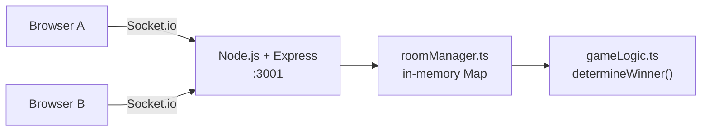
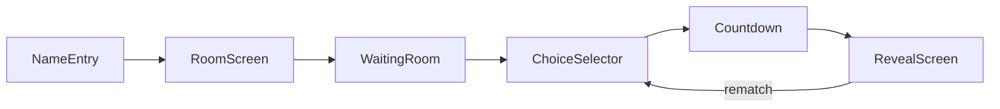

# Multiplayer RPS — 1-Hour Hackathon Plan

## What's Already Done

- [BUILD_PLAN.md](BUILD_PLAN.md) — architecture, socket events, project structure
- [CLAUDE.md](CLAUDE.md) — project memory, auto-loaded by Cursor AI
- [.cursor/rules/core.mdc](.cursor/rules/core.mdc) — always-on coding standards
- [.cursor/rules/frontend.mdc](.cursor/rules/frontend.mdc) — auto-attaches to `*.tsx` files
- [.cursor/rules/backend.mdc](.cursor/rules/backend.mdc) — auto-attaches to `server/**` files

## Revised Scope for 1 Hour

With 1 hour, the only realistic target is a **working MVP**. Stretch goals are bonus only.

**MVP Definition of Done:**

- Two players connect via room code from different browsers
- Both pick Rock/Paper/Scissors — countdown plays — result revealed with ASCII art
- Scoreboard tracks session wins/losses/ties
- Rematch button works

**Cut from MVP (do only if >45 min remain):**

- AI opponent
- Leaderboard / SQLite
- Tournament mode
- Mobile polish

## Architecture




## Screen Flow




## Task Assignments

### You (Lead) — Scaffold + Server

**Start immediately. Everything else blocks on you.**

- **T+0:00 — T+0:15: Scaffold** (Cursor Composer prompt below)
  - `npm create vite@latest client -- --template react-ts`
  - `mkdir server && cd server && npm init -y && npm i express socket.io tsx typescript @types/node`
  - `mkdir shared` — create `shared/types.ts` with `Choice`, `Room`, `Player` types
  - Wire a `ping/pong` test event to confirm Socket.io works
  - **Commit and push immediately** — Justin and Jonathon pull this
- **T+0:15 — T+0:35: Server Core**
  - `server/roomManager.ts` — `Map<string, Room>`, `create_room`, `join_room`, 6-char codes
  - `server/gameLogic.ts` — pure `determineWinner(a, b)` function
  - `server/index.ts` — wire all socket events: `submit_choice` → countdown → `reveal_result`, rematch, disconnect cleanup
- **T+0:35 — T+0:45: Deploy**
  - Push to Railway or Render, set `PORT` env var
  - Share live URL in team chat — everyone tests on it
- **T+0:45+: Integration support** — help unblock Justin/Jonathon, fix socket bugs

**Cursor Composer prompt to use at T+0:00:**

> "You are an expert at Node.js, Socket.io v4, and TypeScript. Using @CLAUDE.md as context, scaffold: (1) server/index.ts with Express + Socket.io, (2) server/roomManager.ts with in-memory Map rooms and 6-char alphanumeric codes, (3) server/gameLogic.ts with a pure determineWinner function, (4) shared/types.ts with Choice, Room, Player types. Wire all socket events from CLAUDE.md. Use tsx for dev."

---

### Justin — Frontend Dev

**Pull scaffold at T+0:15 after Lead's first commit.**

- **T+0:15 — T+0:30: App shell + NameEntry + RoomScreen**
  - `App.tsx` — screen state machine (`'name' | 'room' | 'waiting' | 'choice' | 'countdown' | 'reveal'`)
  - `NameEntry.tsx` — name input form
  - `RoomScreen.tsx` — create room (shows code + copy button) or join room (enter code)
- **T+0:30 — T+0:50: Gameplay screens**
  - `WaitingRoom.tsx` — spinner, show opponent name on `opponent_joined`
  - `ChoiceSelector.tsx` — 3 big buttons (Rock/Paper/Scissors), lock after pick
  - `Countdown.tsx` — "Rock..." → "Paper..." → "Scissors..." → "SHOOT!" at 800ms intervals
  - `RevealScreen.tsx` — ASCII art hands, winner banner, `Scoreboard.tsx` below
- **T+0:50+: Polish** — TailwindCSS dark theme, `font-mono` for ASCII art, mobile layout

**Cursor Composer prompt for each screen:**

> "You are an expert at React, TypeScript, and TailwindCSS. Using @CLAUDE.md for socket event names, build [ScreenName].tsx. It listens for [socket event], renders [description], and calls [next screen transition] when done. Dark theme, font-mono for ASCII art."

---

### Jonathon — Rematch/Disconnect + Stretch

**Pull scaffold at T+0:15. Start with rematch (core MVP requirement).**

- **T+0:15 — T+0:35: Rematch + disconnect** (add to `server/index.ts` after Lead pushes server core)
  - Both players `request_rematch` → emit `rematch_ready` → reset round state
  - `socket.on('disconnect')` → emit `opponent_disconnected` to other player, clean up room
- **T+0:35 — T+0:55: AI Opponent** (highest wow factor stretch goal)
  - `server/aiOpponent.ts` — track last N moves per session, frequency analysis, counter most-played
  - 3 levels: `random`, `adaptive` (frequency), `hard` (Markov chain)
  - New event: `play_vs_ai` → creates single-player room, AI responds after player submits
- **T+0:55+: Leaderboard** (if time allows)
  - `server/leaderboard.ts` — SQLite via `better-sqlite3`, schema: `players(name, wins, losses, ties, streak)`
  - Emit `leaderboard_update` top 10 after each result

**Cursor Composer prompt for AI opponent:**

> "You are an expert at game AI and TypeScript. Build server/aiOpponent.ts that tracks a player's move history in a Map, uses frequency analysis to pick the counter-move, and supports 3 difficulty levels: random, adaptive (frequency), hard (Markov chain). Export a getAiChoice(history: Choice[], difficulty) function."

---

## 1-Hour Timeline

```
T+0:00  You: scaffold + shared/types.ts + ping/pong → commit + push
T+0:15  Justin + Jonathon: git pull and start their tracks
T+0:35  You: server core complete → push; Jonathon: add rematch/disconnect on top
T+0:45  You: deploy to Railway → share URL
T+0:50  All: smoke test on live URL together (5 min)
T+0:55  Justin: polish pass | Jonathon: AI opponent
T+1:00  Demo
```

## Key Cursor Workflow Rules (Already Configured)

- `core.mdc` is always-on — Cursor will enforce TypeScript strict, snake_case events, propose-before-code
- `frontend.mdc` auto-attaches to all `.tsx` files — enforces socket singleton, Tailwind, `useEffect` cleanup
- `backend.mdc` auto-attaches to `server/**` — enforces try/catch, pure game logic, payload validation
- Use `@CLAUDE.md` in every Cursor chat to give the AI full project context instantly
- Commit every 20 minutes — this is your undo button if AI goes sideways

## Critical Path

The single biggest risk is **Justin and Jonathon being blocked** waiting for the scaffold. Your T+0:00–T+0:15 window is the most important 15 minutes of the hackathon. Use Cursor Composer with the prompt above to do it in one shot.